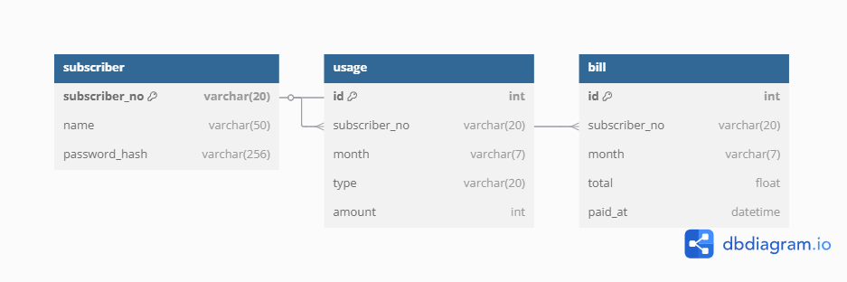

# 📦 Mobile Provider Billing API

This is a RESTful API project built with **Flask**, simulating a mobile provider's billing system. It includes features such as usage tracking, bill calculation, payment processing, and authentication via JWT.

## 📈 Features
- Register/Login subscribers
- Add phone/internet usage
- Calculate monthly bill
- Pay bills 
- List bills and usage details
- Authentication via JWT
- Swagger documentation
- Cloud-deployed via Render.com

---

## 🔧 Technologies Used
- Python 3.10
- Flask
- Flask-JWT-Extended
- Flask-Migrate
- Flask-SQLAlchemy
- Flasgger (Swagger UI)
- PostgreSQL (Render.com hosted)
- Render for deployment

---

## 🌐 Deployed Link
> [https://four458-mobile-provider-project.onrender.com/apidocs](https://four458-mobile-provider-project.onrender.com/apidocs)

You can test all endpoints directly from this Swagger interface.

---

## 🔒 Authentication
All usage and billing routes require a Bearer JWT token. You can obtain this by logging in:

### Register
```json
POST /api/v1/auth/register
{
  "subscriber_no": "999",
  "name": "Test User",
  "password": "test1234"
}
```

### Login
```json
POST /api/v1/auth/login
{
  "subscriber_no": "999",
  "password": "test1234"
}
```
> Returns: `{ "access_token": "..." }`

Include this token as `Bearer <access_token>` in Authorization headers.

---

## 📃 API Endpoints

| Endpoint | Method | Auth | Description |
|----------|--------|------|-------------|
| `/api/v1/auth/register` | POST | No | Register new subscriber |
| `/api/v1/auth/login` | POST | No | Login and get JWT |
| `/api/v1/usage` | POST | Yes | Add phone/internet usage |
| `/api/v1/usage` | GET | Yes | List all usage for current user |
| `/api/v1/calculate-bill` | POST | Yes | Calculate bill for a month |
| `/api/v1/pay-bill` | POST | No | Pay or top-up bill |
| `/api/v1/pay-bill/bill` | GET | Yes | List all paid bills |
| `/api/v1/pay-bill/bill/details` | GET | Yes | Detailed bill info w/ pagination |

---

## 📦 Project Structure
```
app/
├── routes/
│   ├── auth.py
│   ├── usage.py
│   ├── billing.py
│   └── calculatebill.py
├── services/
│   ├── auth_service.py
│   ├── billing_service.py
│   └── usage_service.py
├── models/
│   ├── subscriber.py
│   ├── usage.py
│   └── bill.py
├── extensions.py
└── __init__.py
config.py
main.py
requirements.txt
.env
```

---

## 📊 Environment Setup (Local)
1. Clone the repository
```bash
git clone https://github.com/YOUR_USERNAME/4458-mobile-provider-api.git
cd 4458-mobile-billing-api
```
2. Create and activate virtualenv
```bash
python -m venv venv
source venv/bin/activate  # or venv\Scripts\activate on Windows
```
3. Install requirements
```bash
pip install -r requirements.txt
```
4. Setup `.env` file:
```env
DATABASE_URL=your_postgresql_url
JWT_SECRET_KEY=your_jwt_secret
```
5. Run app:
```bash
flask --app main run
```
6. Visit: `http://localhost:5000/apidocs`

---

## 🗃️ Data Model (ER Diagram)



---

## 🚀 Deployment on Render
- Add environment variables from `.env`
- Use `gunicorn main:app` as start command
- Confirm `requirements.txt` has `gunicorn`, `flask`, etc.
- Done!

---

## ✨ Developer
- Name: Işıl Ülger
- Course: SE 4458 Midterm Project (Spring 2025)
- Project: Mobile Provider Billing System

---

## 🎥 Demo Video Link
- .
